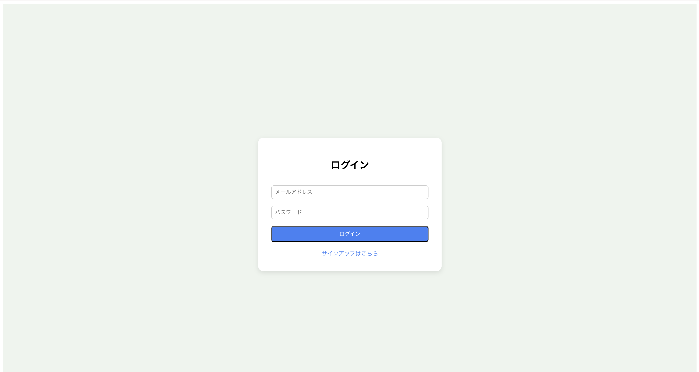
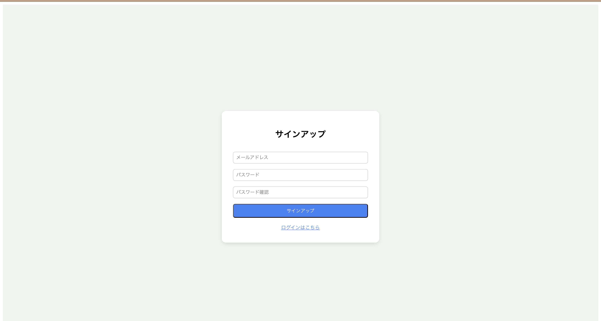
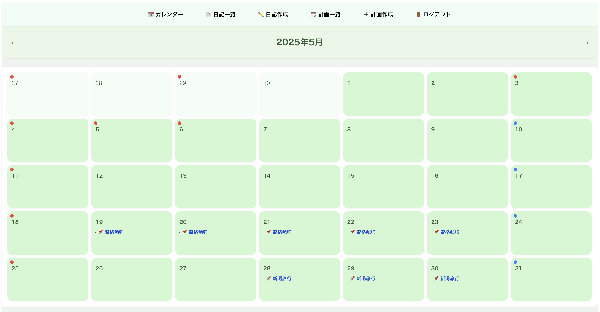
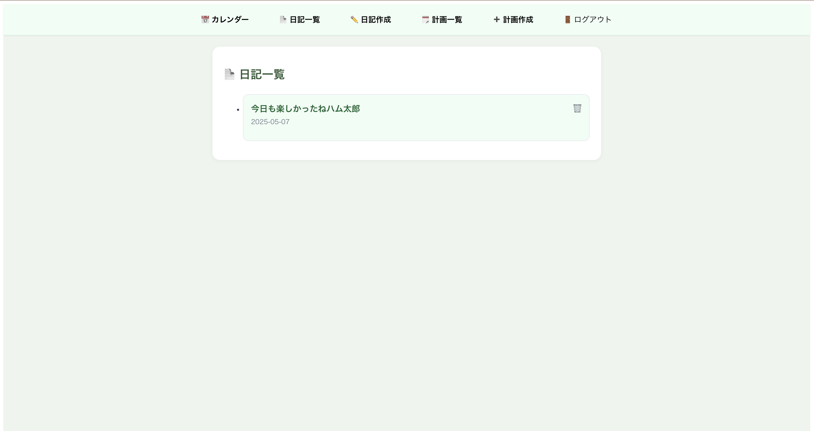
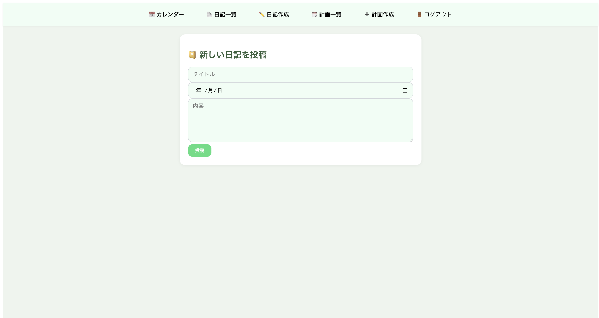
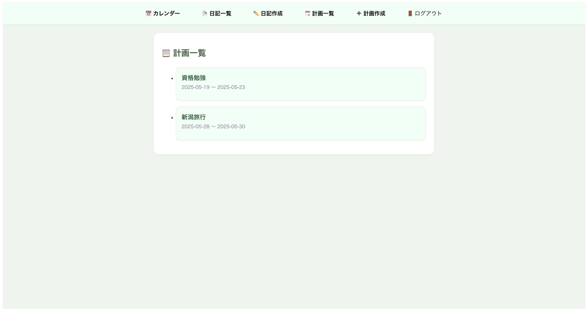
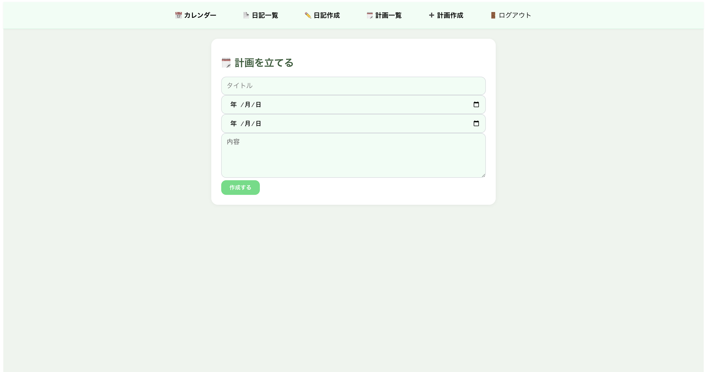

# DailyNote（日記＆計画アプリ）

- **Next.js + Rails API + Docker** で構築した個人用日記アプリ
- 日々の記録や計画を投稿・編集・削除できるシンプルな構成で、認証機能も備えてます

## 技術スタック

| フロントエンド       | バックエンド                 | インフラ / 開発補助         |
|----------------------|------------------------------|------------------------------|
| Next.js (App Router) | Ruby on Rails APIモード      | Docker / Docker Compose     |
| TypeScript           | Devise / devise_token_auth   | Git / GitHub                |
| Tailwind CSS         | PostgreSQL                   |                              |

## 主な機能
- ユーザー認証（サインアップ / ログイン / ログアウト）
- 日記（作成・一覧・詳細・編集・削除）
- 計画（開始日・終了日・内容を管理）

## 画面構成

- `/login`: ログイン  
  

- `/signup`: サインアップ  
  

- `/`: カレンダートップ  
  

- `/diaries`: 日記一覧  
  

- `/diaries/new`: 日記新規作成  
  

- `/plans`: 計画一覧  
  

- `/plans/new`: 計画新規作成  
  